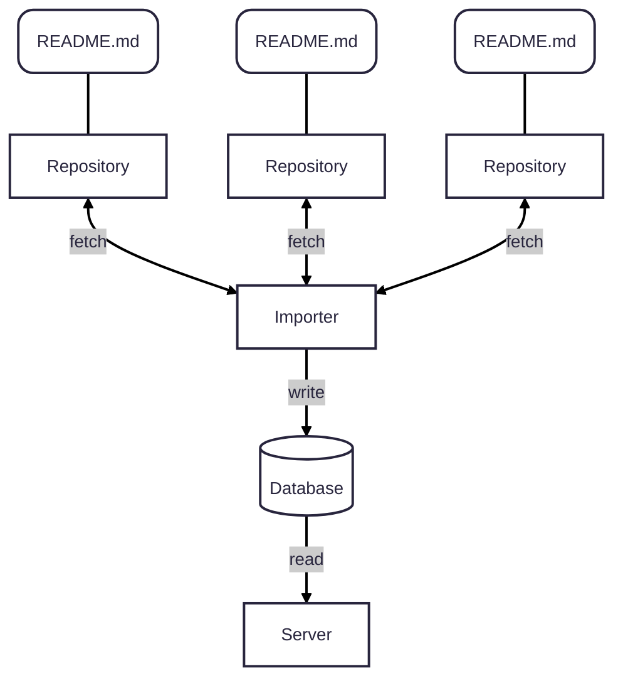

# Documenter

## Architecture

```mermaid
---
config:
      theme: redux
---
flowchart TD
        Server[Server]
        Database[(Database)]
        Importer[Importer]
        RepositoryA[Repository]
        RepositoryB[Repository]
        RepositoryC[Repository]
        ReadmeA(README.md)
        ReadmeB(README.md)
        ReadmeC(README.md)

        ReadmeA --- RepositoryA
        ReadmeB --- RepositoryB
        ReadmeC --- RepositoryC
        RepositoryA & RepositoryB & RepositoryC <-->|fetch| Importer
        Importer -->|write| Database
        Database -->|read| Server
```
